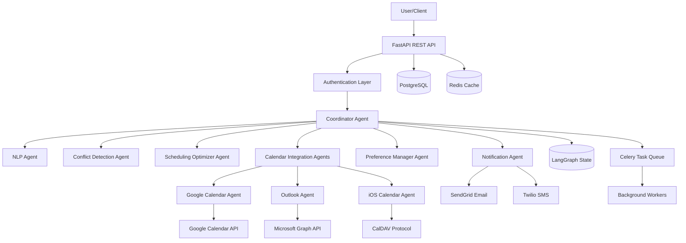
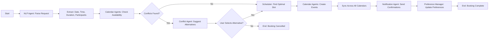

# Multi-Agent Appointment Booking System Architecture

## System Overview

This system uses a multi-agent architecture powered by LangGraph and LangChain to orchestrate intelligent appointment booking across multiple calendar platforms (Google Calendar, Outlook, iOS Calendar).

## Technology Stack

- **Backend Framework**: FastAPI (Python 3.11+)
- **Multi-Agent Orchestration**: LangGraph + LangChain
- **Database**: PostgreSQL with SQLAlchemy ORM
- **Caching**: Redis
- **Message Queue**: Celery with Redis broker
- **Authentication**: OAuth 2.0 + JWT
- **Calendar APIs**: Google Calendar API, Microsoft Graph API, CalDAV (iOS)
- **Notifications**: SendGrid (Email), Twilio (SMS)
- **LLM**: OpenAI GPT-4 or Anthropic Claude

## Multi-Agent Architecture

### Agent Roles

#### 1. Coordinator Agent (Supervisor)
- **Responsibility**: Orchestrates all other agents and manages workflow state
- **Tools**: LangGraph state management, agent routing
- **Decisions**: Routes requests to appropriate specialized agents

#### 2. NLP Agent (Natural Language Processor)
- **Responsibility**: Parses natural language booking requests
- **Tools**: LangChain LLM chains, prompt templates
- **Output**: Structured booking data (date, time, duration, participants, preferences)

#### 3. Calendar Integration Agents
- **Google Calendar Agent**: Manages Google Calendar operations
- **Outlook Agent**: Manages Microsoft Outlook/365 operations
- **iOS Calendar Agent**: Manages CalDAV-based iOS calendar operations
- **Tools**: Calendar-specific APIs, OAuth handlers
- **Operations**: Create, read, update, delete events; check availability

#### 4. Conflict Detection Agent
- **Responsibility**: Identifies scheduling conflicts across all calendars
- **Tools**: Time slot analysis, calendar comparison algorithms
- **Output**: Conflict reports with suggested resolutions

#### 5. Scheduling Optimizer Agent
- **Responsibility**: Finds optimal time slots based on preferences and availability
- **Tools**: Constraint satisfaction algorithms, preference scoring
- **Output**: Ranked list of available time slots

#### 6. Notification Agent
- **Responsibility**: Sends confirmations, reminders, and updates
- **Tools**: Email API (SendGrid), SMS API (Twilio)
- **Triggers**: Event creation, updates, reminders (24h, 1h before)

#### 7. Preference Manager Agent
- **Responsibility**: Manages user preferences and learning
- **Tools**: User profile database, preference learning algorithms
- **Data**: Working hours, preferred meeting times, buffer times, notification preferences

## System Architecture Diagram

## LangGraph Workflow

### Booking Request Flow

## Database Schema

### Core Tables

#### users
- id (UUID, PK)
- email (String, unique)
- name (String)
- timezone (String)
- created_at (Timestamp)
- updated_at (Timestamp)

#### calendars
- id (UUID, PK)
- user_id (UUID, FK)
- provider (Enum: google, outlook, ios)
- calendar_id (String)
- access_token (Encrypted)
- refresh_token (Encrypted)
- is_primary (Boolean)
- sync_enabled (Boolean)
- created_at (Timestamp)

#### appointments
- id (UUID, PK)
- user_id (UUID, FK)
- title (String)
- description (Text)
- start_time (Timestamp)
- end_time (Timestamp)
- timezone (String)
- location (String)
- status (Enum: pending, confirmed, cancelled)
- created_by_agent (String)
- created_at (Timestamp)
- updated_at (Timestamp)

#### calendar_events
- id (UUID, PK)
- appointment_id (UUID, FK)
- calendar_id (UUID, FK)
- external_event_id (String)
- sync_status (Enum: synced, pending, failed)
- last_synced_at (Timestamp)

#### user_preferences
- id (UUID, PK)
- user_id (UUID, FK)
- working_hours_start (Time)
- working_hours_end (Time)
- preferred_meeting_duration (Integer)
- buffer_time_minutes (Integer)
- notification_email (Boolean)
- notification_sms (Boolean)
- reminder_24h (Boolean)
- reminder_1h (Boolean)
- auto_decline_conflicts (Boolean)

#### participants
- id (UUID, PK)
- appointment_id (UUID, FK)
- email (String)
- name (String)
- status (Enum: pending, accepted, declined)

## API Endpoints

### Authentication
- POST `/auth/register` - Register new user
- POST `/auth/login` - Login user
- POST `/auth/refresh` - Refresh access token
- POST `/auth/logout` - Logout user

### Calendar Management
- GET `/calendars` - List user's connected calendars
- POST `/calendars/connect/{provider}` - Connect calendar (OAuth flow)
- DELETE `/calendars/{calendar_id}` - Disconnect calendar
- PUT `/calendars/{calendar_id}/sync` - Trigger manual sync

### Appointments
- POST `/appointments` - Create appointment (natural language or structured)
- GET `/appointments` - List appointments (with filters)
- GET `/appointments/{appointment_id}` - Get appointment details
- PUT `/appointments/{appointment_id}` - Update appointment
- DELETE `/appointments/{appointment_id}` - Cancel appointment
- GET `/appointments/availability` - Check availability

### Preferences
- GET `/preferences` - Get user preferences
- PUT `/preferences` - Update user preferences

### Webhooks
- POST `/webhooks/google` - Google Calendar webhook
- POST `/webhooks/outlook` - Outlook webhook

## Security Considerations

1. **OAuth 2.0**: All calendar integrations use OAuth 2.0 for secure authorization
2. **Token Encryption**: Access and refresh tokens encrypted at rest
3. **JWT Authentication**: Stateless authentication for API requests
4. **Rate Limiting**: Prevent API abuse
5. **Input Validation**: Strict validation of all user inputs
6. **HTTPS Only**: All communications over TLS
7. **Secret Management**: Environment variables for sensitive data

## Scalability Considerations

1. **Horizontal Scaling**: Stateless API design allows multiple instances
2. **Caching**: Redis for frequently accessed data
3. **Async Processing**: Celery for background tasks (sync, notifications)
4. **Database Indexing**: Optimized queries with proper indexes
5. **Connection Pooling**: Efficient database connection management
6. **CDN**: Static assets served via CDN

## Monitoring and Logging

1. **Agent Activity Logs**: Track all agent decisions and actions
2. **Performance Metrics**: API response times, agent execution times
3. **Error Tracking**: Centralized error logging with stack traces
4. **Calendar Sync Status**: Monitor sync health across providers
5. **Notification Delivery**: Track email/SMS delivery rates

## Development Phases

### Phase 1: Foundation (Weeks 1-2)
- Project setup and dependencies
- Database schema and models
- Basic FastAPI structure
- Authentication system

### Phase 2: Calendar Integration (Weeks 3-4)
- Google Calendar agent
- Outlook agent
- iOS Calendar agent
- Basic CRUD operations

### Phase 3: Multi-Agent System (Weeks 5-6)
- LangGraph workflow setup
- Coordinator agent
- NLP agent
- Agent orchestration

### Phase 4: Intelligence Layer (Weeks 7-8)
- Conflict detection agent
- Scheduling optimizer agent
- Preference manager agent
- Learning algorithms

### Phase 5: Notifications & Polish (Weeks 9-10)
- Notification agent
- Email/SMS integration
- Webhook handlers
- Error handling and retry logic

### Phase 6: Testing & Deployment (Weeks 11-12)
- Unit and integration tests
- Docker containerization
- CI/CD pipeline
- Documentation
- Production deployment

## Future Enhancements

1. **AI-Powered Suggestions**: Learn from booking patterns
2. **Group Scheduling**: Find optimal times for multiple participants
3. **Meeting Room Booking**: Integrate with room reservation systems
4. **Video Conferencing**: Auto-generate Zoom/Meet links
5. **Mobile Apps**: Native iOS and Android applications
6. **Voice Interface**: Alexa/Google Assistant integration
7. **Analytics Dashboard**: Booking patterns and insights